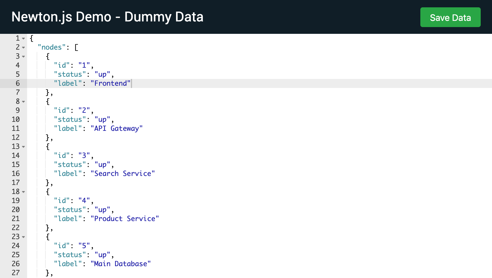

# Newton.js demo - data server

This is a fake server used to mimic real time data for [Newton.js network graph](https://github.com/julie-ng/newtonjs-graph). This server uses a [pre-built Ace code editor](https://github.com/ajaxorg/ace-builds).



## Use

First install dependencies as usual:

```
npm install
```

And then start the server:

```
npm start
```

Then open [http://localhost:3000/](http://localhost:3000) in your browser to edit the data as JSON. 

### Push updates

Click the **save button** to push server updates.